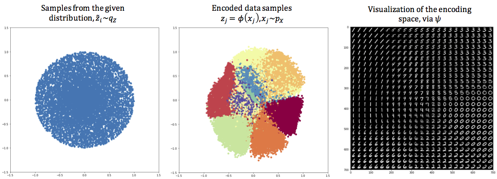
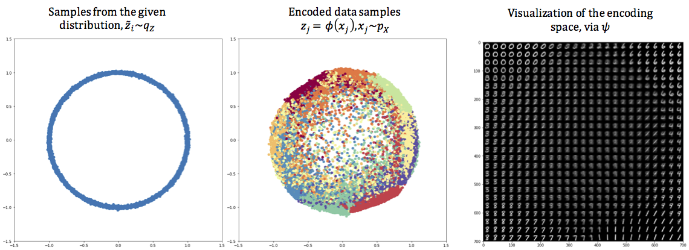

# SlicedWassersteinAE

This repository contains the implementation of our paper: ["Sliced-Wasserstein Autoencoder: An Embarrassingly Simple Generative Model"](https://arxiv.org/pdf/1804.01947.pdf). The proposed method ameliorates the need for training adversarial networks in training generative models, and it provides a stable optimization while having a very simple implementation. 

### SWAE_MNIST_uniform.ipynb

This notebook trains the SWAE on the MNIST dataset with a uniform distribution in the embedding space. The figure below visualizes the embedded data and the embedding space for the MNIST dataset:

### SWAE_MNIST_Circle.ipynb

Similarly, this notebook trains the SWAE on the MNIST dataset with a disk distribution in the embedding space. The figure below visualizes the embedded data and the embedding space for the MNIST dataset:

### SWAE_MNIST_Ring.ipynb

Similarly, this notebook trains the SWAE on the MNIST dataset with a ring distribution in the embedding space. The figure below visualizes the embedded data and the embedding space for the MNIST dataset:

### Pretrained Models

The pretrained SWAE modules are also uploaded:

* LearnedModels/MNIST_uniform(circle)(ring)_autoencoder.h5
* LearnedModels/MNIST_uniform(circle)(ring)_encoder.h5
* LearnedModels/MNIST_uniform(circle)(ring)_decoder.h5

